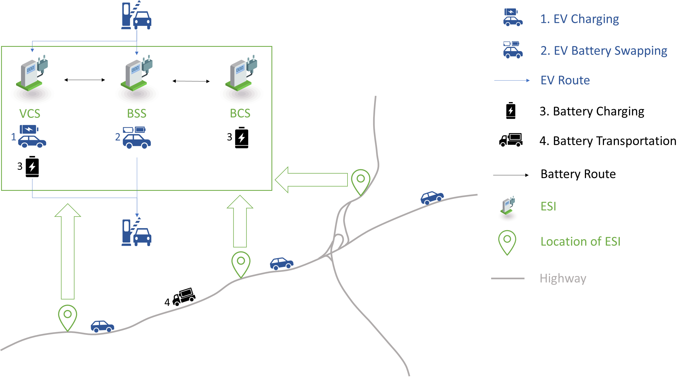
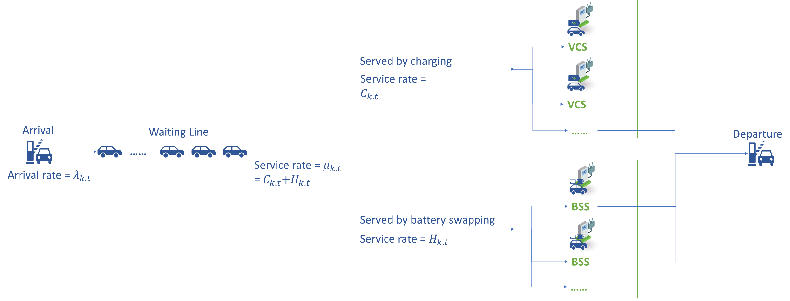

# Optimal Siting and Sizing of Electric Vehicle Energy Supplement Infrastructure in Highway Networks



This repository contains the code and data necessary to achieve the model presented in the paper [Optimal Siting and Sizing of Electric Vehicle Energy Supplement Infrastructure in Highway Networks](https://www.mdpi.com/2411-5134/8/5/117). In this research, a mixed integer linear programming (MILP) model is proposed to optimize the location and capacity of ESIs, including vehicle charging stations (VCSs), battery swapping stations (BSSs), and battery charging stations (BCSs), in highway networks. The objective of this model is to minimize the total cost with the average waiting time for EVs being constrained. In this model, battery swapping and transportation behaviors are optimized such that the EV average waiting time can be reduced, and the average queue and service process waiting time is estimated by the M/M/1 model. Real-world data, i.e., from the London M25 highway network system, are used as a case study to test the effectiveness of the proposed method. The results show that considering battery transportation behaviors is more cost efficient, and the results are sensitive to the EV average waiting time tolerance, battery cost, and charging demand. Note that the performance and the results can vary due to version of Gurobi solver and the gap.



## Requirements

- Python 3.x
- pandas
- numpy
- os
- math
- networkx
- gurobipy

## Installation

1. Install the required Python libraries:

    ```sh
    pip install pandas numpy networkx gurobipy
    ```

2. Ensure you have Gurobi installed and properly licensed. Followed are some useful links:

    Gurobi License: [How do I obtain a Gurobi license?](https://support.gurobi.com/hc/en-us/articles/12684663118993-How-do-I-obtain-a-Gurobi-license)

    Gurobi Installation: [How do I install Gurobi Optimizer?](https://support.gurobi.com/hc/en-us/articles/4534161999889-How-do-I-install-Gurobi-Optimizer)

    Get Started: [Getting Started with Gurobi Optimizer](https://support.gurobi.com/hc/en-us/articles/14799677517585-Getting-Started-with-Gurobi-Optimizer)

    [How do I set up Gurobi in WSL2 (Windows Subsystem for Linux)?](https://support.gurobi.com/hc/en-us/articles/7367019222929-How-do-I-set-up-Gurobi-in-WSL2-Windows-Subsystem-for-Linux)

## Data Preparation

We generate London M25 highway network system traffic flow data using data from the [National Highways of the UK](https://webtris.highwaysengland.co.uk/).


Place the following files in the `data` directory:

- `Node.csv`: Contains information about highway nodes.
- Traffic flow CSV files: Named according to the format specified in `Node.csv`.

## Running the Model

1. Place the script files `data.py`, `model.py`, and `test.py` in your working directory.
2. Run the optimization script:

    ```sh
    python test.py
    ```

The script will load the data, process it, create a traffic network graph, define and solve the optimization model, and save the results to `results.txt`. If the model is infeasible, the IIS will be saved to `model.ilp`.

A step-by-step development of the code is shown in `EV_Infrastructure_Planning.ipynb`.